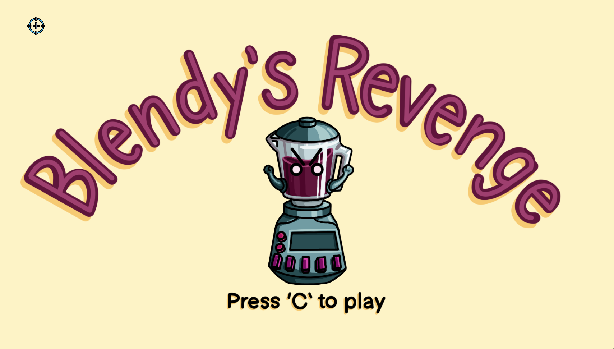
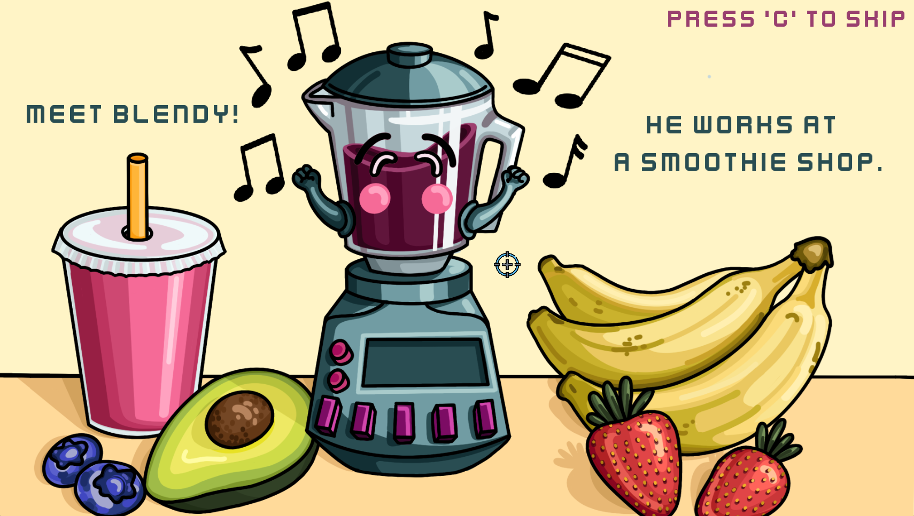
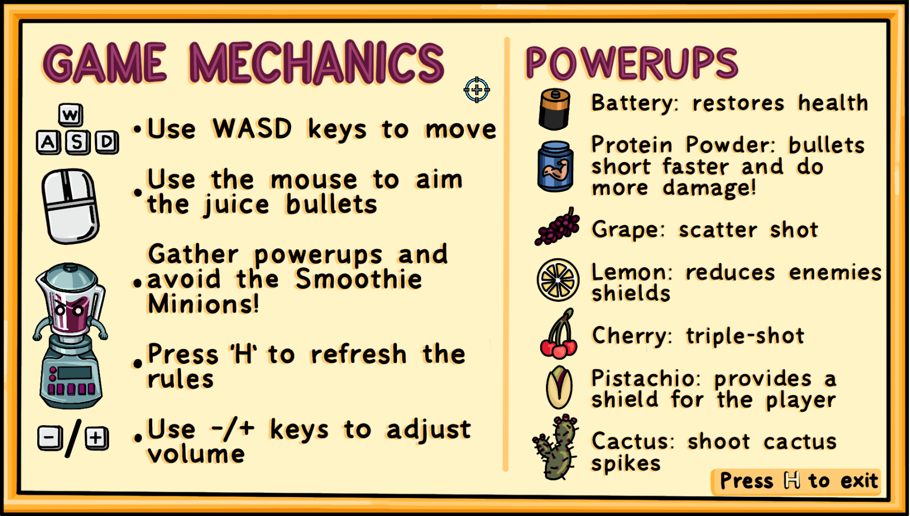
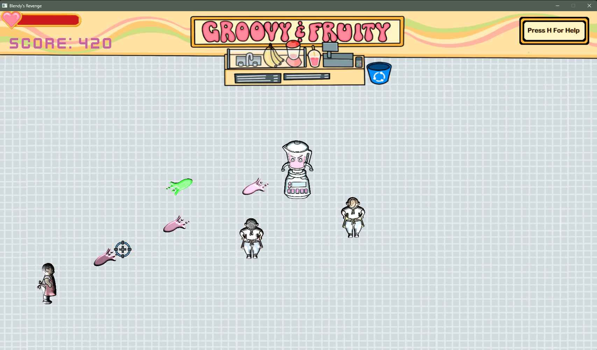

# Blendy's Revenge
Blendy's Revenge is a Bullet Hell survival game that I made in a team of 6 using our own game engine for a Video Game Programming Course @ UBC.
My role was primarily as a Programmer, Project Manager, and Game Designer. 

## Peak Gameplay

  

## Some things I programmed:
- Blinn-Phong Illumination using Normal Mapping for the sprites
- Oscillating Rainbow Shader For Giant Minion
- Particle System With Instanced Rendering (For initial-game particles)
- Audio Triggers
- Game Score Counter
- FPS Counter (Press 'F' to view)

## Other things I worked on:
- Project Management - Planning out game proposal, breaking up tasks, and assigning to those willing.
- Game Optimization - Worked on smoothing out FPS by improving the time complexity of collision detection code and reducing the number of triangles in static meshes used for collision detection using MeshMixer (https://meshmixer.com/)
- Normal Maps - Created sprite normal maps using Laigter (https://azagaya.itch.io/laigter)
- Game Audio - Chose game background music and Audio FX
- Bug Fixing - Troubleshooted multiple bugs over time and resolved them
- Game Design - Balanced the game and made it fun to play

# Skills
## Hard Skills
C++, OpenGL, GLSL, Entity-Component Systems (ECS), CMake, Visual Studio 2022, Game Design

## Soft Skills
Teamwork, Communication, Conflict Resolution, Project Management

# Some Images
## First Cutscene

## How To Play

## Early Game

